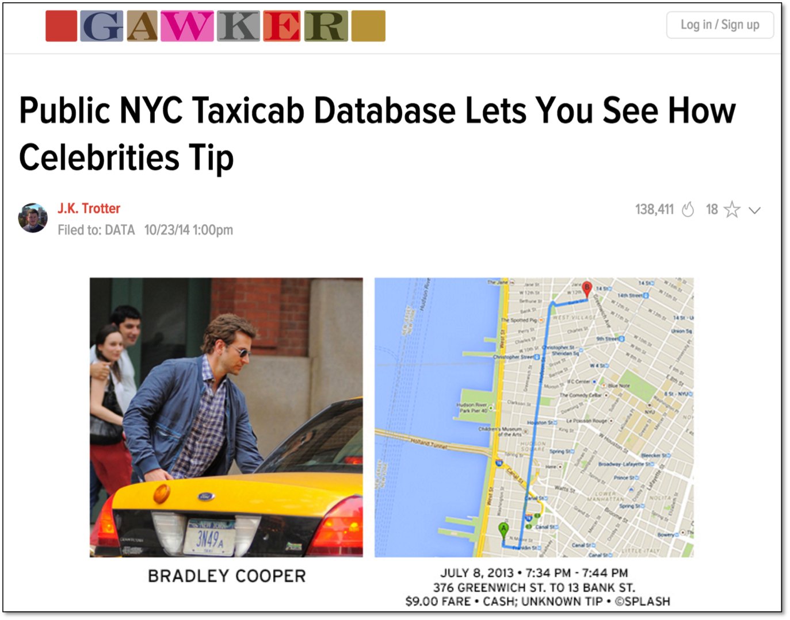
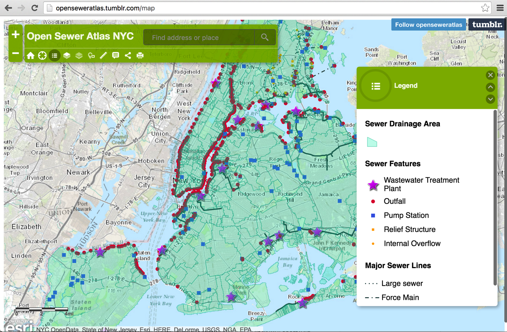

layout:true

  
  
The Concerns of Open Data

  

    
    
      
      

--

class: center,middle

# The Concerns of Open Data

- - -

## Presenter: Richard Dunks

###### &nbsp;

### Follow along at: https://bit.ly/open-data-concerns

#### See the code at: https://bit.ly/open-data-concerns-code

<strong><strong>The Concerns of Open Data</strong></strong> by <a xmlns:cc="http://creativecommons.org/ns#" href="http://www.datapolitan.com" property="cc:attributionName" rel="cc:attributionURL">Richard Dunks</a> is licensed under a <a rel="license" href="http://creativecommons.org/licenses/by-sa/4.0/">Creative Commons Attribution-ShareAlike 4.0 International License</a>

---

name:open-data
# Definition of Open Data
--

> Open data is data that can be freely used, shared and built-on by anyone, anywhere, for any purpose

## - [Open Knowledge International](http://blog.okfn.org/2013/10/03/defining-open-data/)

---

class:center,middle

# Open Data Concerns

---

# Privacy
--

+ Personally identifiable information (PII)
--

.caption[Source: [Wired Magazine](https://www.wired.com/2013/07/mugshot-removal-extortion/)]

---

# Privacy
+ Personally identifiable information (PII)

.caption[Source: [Gawker](http://gawker.com/the-public-nyc-taxicab-database-that-accidentally-track-1646724546)]

---

# Privacy
+ Personally identifiable information (PII)

.caption[Source: [The Interdisciplinary Internet Institute](https://web.archive.org/web/20150318175539/http://theiii.org/index.php/997/using-nyc-taxi-data-to-identify-muslim-taxi-drivers/)]

---

# Privacy
+ Personally identifiable information (PII)
+ [Mosaic Effect](https://fcw.com/articles/2014/05/13/fose-mosaic.aspx)
--

.caption[The Center for Government Excellence's [Privacy Matrix](https://govex.jhu.edu/wiki/privacy_matrix/)]

---

# Security
--

+ Identify sensitive infrastructure
--

.caption[[Open Sewer Atlas](http://openseweratlas.tumblr.com/map)]

---

# Security
+ Identify sensitive infrastructure
+ Describe methods and procedures

---

# Reliability
--

+ Accuracy
--

+ Timeliness

---
exclude:true

# Ways to Learn More
+ [Open Data Handbook](http://opendatahandbook.org/)
+ [State of the Union of Open Data](https://www.datafoundation.org/the-state-of-the-union-of-open-data-ed-3)
+ [Open Data 500](https://www.opendata500.com/)

---

# Contact Information
+ [Email me](mailto:richard[at]datapolitan[dot]com)
+ Check out [my website](https://wwww.datapolitan.com)
+ Connect on [Twitter](https://twitter.com/Datapolitan)
+ Connect on [LinkedIn](https://www.linkedin.com/in/richarddunks/)
+ Follow us on [Instagram](https://www.instagram.com/datapolitan/)
+ Follow us on [Eventbrite](https://www.eventbrite.com/o/datapolitan-18675558166) to learn about our workshops

---

class:middle,center
# Thank You!

## And go find some open data  about your community!

